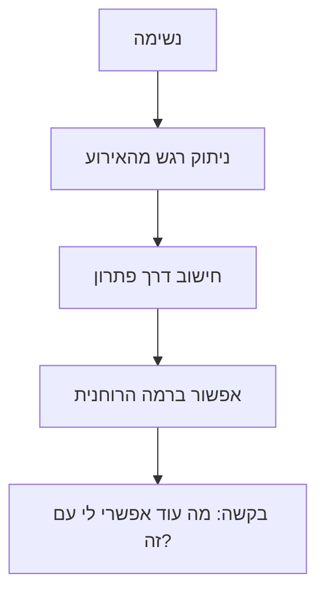

# התנהלות תחת לחץ

## השלבים
1. **נשימה** — לעצור, לקחת אוויר, להתמקם בגוף.
2. **ניתוק רגש מהאירוע** — להפריד בין מה שקרה לבין התגובה הרגשית.
3. **חישוב דרך פתרון** — לבחון את האפשרויות בראש צלול.
4. **אפשור ברמה הרוחנית** — לפתוח מקום, לשחרר התנגדות.
5. **בקשה** — לשאול: *מה עוד אפשרי לי עם זה?*
][[מסחר]]
#לחץ #התנהלות #רוחניות #מיינדסט
